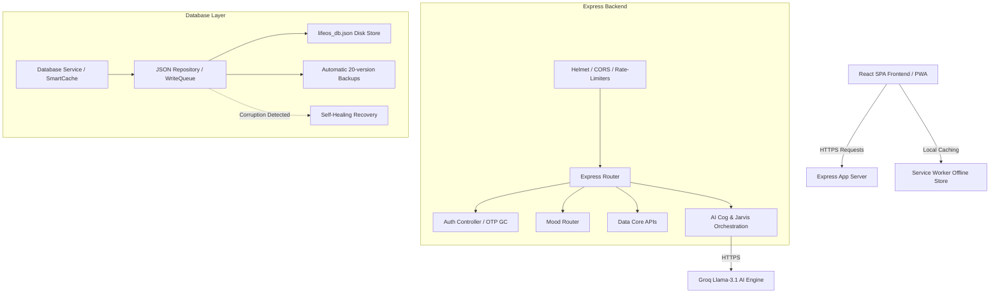

# LifeOS System Architecture & Hardening Overview

This document provides a comprehensive overview of the design, security, reliability, and observability patterns implemented in the LifeOS personal cockpit and Piggy AI Core.

---

## 1. System Topology

---

## 2. Key Architecture Refactoring

### 2.1 Domain Separation (Mood Routing)
- We migrated the mood tracker API endpoints out of `data.routes.ts` into a clean, dedicated routing module `routes/mood.ts`.
- This ensures clean separation of concerns, simplifies testing, and conforms to RESTful api design guidelines.

### 2.2 Database Concurrency Protection
- Since the database uses `lifeos_db.json` as a flat-file database, parallel async requests could cause write overlaps or file truncation.
- We implemented an async **`WriteQueue`** inside `JSONRepository` that serializes all file system write operations. This prevents overlapping writes and ensures atomic filesystem consistency.

---

## 3. Reliability & Self-Healing

### 3.1 Self-Healing DB Restoration
- During initialization, the database service verifies schema integrity.
- If it detects syntax errors, corruption, or missing root structures (`users`, `userData`), it scans the `backup/` directory, sorts backups by date, finds the latest valid backup file, and automatically restores it to self-heal the server without crash downtime.

### 3.2 Graceful Shutdown Lifecycle
- The server captures `SIGINT` (Ctrl+C) and `SIGTERM` signals.
- On receipt, the Express listener stops accepting new connections, allows active HTTP operations and DB queues to finish writing, and then shuts down the process cleanly.

### 3.3 Unhandled Errors Capture
- Standard global hooks for `uncaughtException` and `unhandledRejection` capture system failures, log them with full stack traces, and exit gracefully to prevent deadlocks or silent errors.

---

## 4. Security & Hardening

### 4.1 Request Rate-Limiting
- Brute-force protection via `express-rate-limit` blocks automated dictionary attacks on sensitive endpoints: `/api/auth/register`, `/api/auth/verify-otp`, and `/api/auth/login`.

### 4.2 OTP Garbage Collection
- The registration OTP store is guarded by a periodic memory garbage collector running every 60 seconds (`setInterval` unrefed), evicting expired verification hashes to prevent slow memory exhaustion.

### 4.3 Secure HTTP Headers
- Integrated `helmet` middleware to mount standard HTTP security headers (X-XSS-Protection, HSTS, frame options, sniffing protection).

---

## 5. Observability & Logging

### 5.1 Winston Structured Logging
- Replaced console wrappers with a structured **Winston** daily-rotated logging system.
- Logs are divided into `logs/info-%DATE%.log` and `logs/error-%DATE%.log` with a 14-day retention limit.

### 5.2 AsyncLocalStorage Request Tracing
- Integrates `AsyncLocalStorage` to store unique correlation IDs (generated per request by `requestIdMiddleware`) and automatically appends `requestId` logs across all asynchronous loops without requiring manual parameter passing.

---

## 6. PWA Offline Caching Strategy
- **Web Manifest**: `manifest.json` configures startup colors, stand-alone display modes, and icons to support full home screen installations.
- **Service Worker**: `sw.js` implements a caching strategy for app shells, stylesheets, and bundles, providing instant loading and fallback to `index.html` during offline matrix operations.
